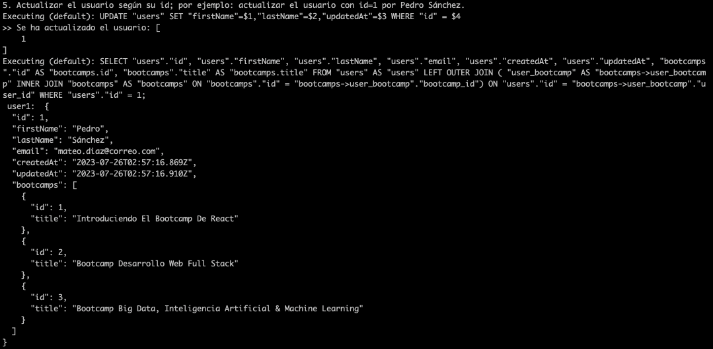

# Final Drilling

- Para usar el proyecto debe instalar las dependencias: `npm install`

- Una vez instalandas las dependencias podrá correr el servidor: `npm run server`.

- Debe tomar en cuenta la configuracion de la base de datos:

```
module.exports = {
  HOST: 'localhost',
  USER: 'node_user',
  PASSWORD: 'node_password',
  DB: 'db_bootcamp',
  dialect: 'postgres',
  pool: {
    max: 5,
    min: 0,
    acquire: 30000,
    idle: 10000
  }
}
```

- Tambien puede ver los resultados de las consultas en la carpeta consultas:
  - Consultando el Bootcamp por id, incluyendo los usuarios 
  - Listar todos los Bootcamp con sus usuarios 
  - Consultado los usuarios (id) incluyendo los bootcamp 
  - Listar los usuarios con sus Bootcamp 
  - Actualizar el usuario según su id; por ejemplo: actualizar el usuario con id=1 por Pedro Sánchez 
  - Eliminar un usuario por id; por ejemplo: el usuario con id=1 
